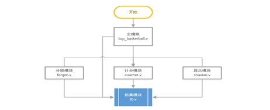
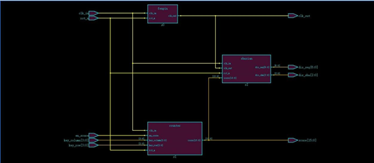
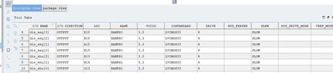
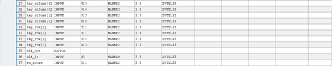
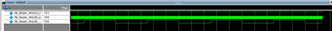
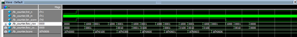
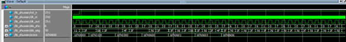
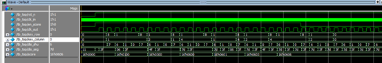

# 篮球计数器

UPC 数字电子技术课设——篮球计数器

开发平台 [Pango Design Suite](https://www.pangomicro.com/en/) 开发语言 Verilog HDL

### Introduction

###### 模块设计

###### 系统连接

###### 管教分配

### Usage

按照软件的启动配置进行

### Description

###### 分频模块

###### 计数模块

###### 显示模块

###### 系统波形

